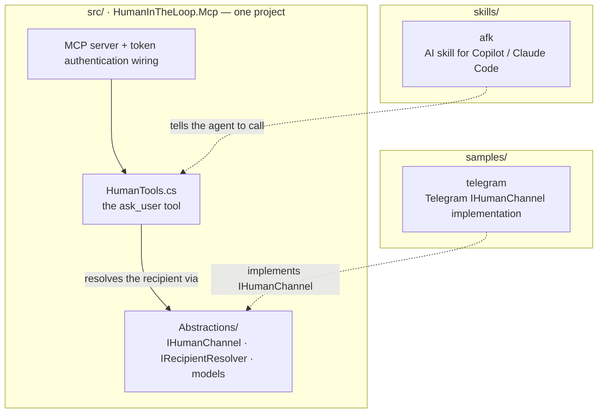
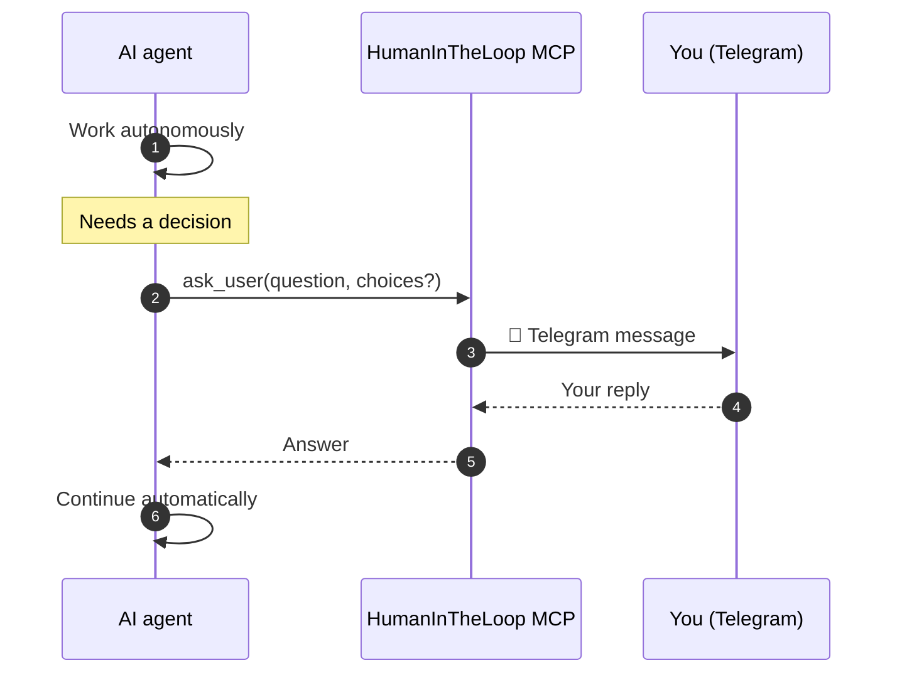

# HumanInTheLoop MCP

> **Let AI agents work while you're away — they only message you when they need you.**

Run your AI coding agent for hours. When it hits a decision it can't safely make on its own — *deploy to prod? delete these files? which branch?* — it asks you on **Telegram**, waits for your reply, and continues automatically.

No more sitting in front of your terminal waiting for the next prompt.

**Works with GitHub Copilot, Claude Code, Cursor, and any MCP-compatible agent.**

---

## The problem

AI agents are great at execution. They're terrible at assumptions.

* Should I deploy to production?
* Which implementation should I choose?
* Is it safe to delete these files?
* Which branch should I target?
* Should I refactor this?

Normally the agent stops and waits. With HumanInTheLoop it asks you wherever you are — and resumes the moment you answer.

---

# Get started in 2 minutes

The fastest path uses the **hosted** version — nothing to deploy, no bot to run.

### 1. Install the AFK skill

The skill teaches your agent *when* to interrupt you instead of guessing.

```bash
# GitHub Copilot CLI — trust this MCP for the current repo
npx github:darthlotu5/HumanInTheLoopMCP --ai copilot

# ...for every project, not just this one
npx github:darthlotu5/HumanInTheLoopMCP --ai copilot --global

# ...fully hands-free: also pre-approve file writes so AFK never blocks
npx github:darthlotu5/HumanInTheLoopMCP --ai copilot --afk

# Claude Code (same flags: --global, --afk)
npx github:darthlotu5/HumanInTheLoopMCP --ai claude
```

Restart your AI client. Type `/afk` when you step away to route questions to your phone, and `/afk stop` to bring them back to the terminal.

The installer also allow-lists the MCP so `ask_user` runs without a permission prompt. Flags:

| Flag | Effect |
| ---- | ------ |
| _(none)_ | Install for the current repo/folder. |
| `--global` | Install for every project (personal skills dir). |
| `--afk` | Also pre-approve file writes so hands-free edits never stop on a local prompt. For shell commands too, launch `copilot --allow-all-tools`. |

> **Why `--afk`?** The MCP can only relay questions the agent chooses to send — it can't intercept Copilot CLI's own permission prompts for built-in tools like `create`/`edit`. `--afk` pre-approves those for the folder so an away-from-keyboard session doesn't silently block.

### 2. Create an account

Sign in at **[humanintheloop-mcp.azurewebsites.net](https://humanintheloop-mcp.azurewebsites.net)**.

### 3. Connect Telegram

In the dashboard:

```
✔ Message the bot
✔ Paste the 6-digit code
✔ Connected
```

### 4. Copy your MCP configuration

The dashboard mints a token and hands you a ready-to-paste config.

**Copilot CLI** — add to `~/.copilot/mcp-config.json`:

```json
{
  "mcpServers": {
    "human-in-the-loop": {
      "type": "http",
      "url": "https://humanintheloop-mcp.azurewebsites.net/mcp",
      "headers": { "Authorization": "Bearer YOUR_TOKEN" }
    }
  }
}
```

**Claude Code** — run:

```bash
claude mcp add --transport http human-in-the-loop \
  https://humanintheloop-mcp.azurewebsites.net/mcp \
  --header "Authorization: Bearer YOUR_TOKEN"
```

Restart your client.

**Done.** Kick off a long task, walk away, and answer on Telegram when your agent needs you. Watch requests and replies stream live in your dashboard.

---

## Works with

* GitHub Copilot
* Claude Code
* Cursor
* Any MCP client supporting Streamable HTTP

---

## The `ask_user` tool

Your agent calls one tool:

```text
ask_user(
    question,
    choices?,
    allowFreeform?,
    repository?,
    branch?,
    conversation?,
    context?
)
```

You get a message like this on Telegram:

```
Should I deploy to Production?

[ Deploy ]

[ Cancel ]
```

Tap a choice (or type a reply) and the AI continues automatically.

---

## Self-hosting

Want complete control? Run your own server and Telegram bot instead of using the hosted platform.

### 1. Clone

```bash
git clone https://github.com/darthlotu5/HumanInTheLoopMCP.git
cd HumanInTheLoopMCP
```

### 2. Create a Telegram bot

Create a bot with **@BotFather** and copy the bot token.

### 3. Configure

```bash
cp samples/telegram/appsettings-example.json samples/telegram/appsettings.json
```

| Setting          | Description                |
| ---------------- | -------------------------- |
| AccessToken      | Secret used by MCP clients |
| TelegramBotToken | Bot token from BotFather   |
| DefaultRecipient | Your Telegram chat id      |

To find your chat id, message your bot, open `https://api.telegram.org/bot<YOUR_BOT_TOKEN>/getUpdates`, and copy `result[].message.chat.id`.

### 4. Run

```bash
cd samples/telegram
dotnet run
```

Your MCP endpoint is available at `http://localhost:5000/mcp`.

### 5. Deploy

Deploy anywhere that runs .NET 10 — Azure App Service, Azure Container Apps, Docker, a Linux VM. No WebSockets required.

Then point your MCP client at `https://YOUR_SERVER/mcp` with `Authorization: Bearer <your AccessToken>`.

---

## Architecture



How a question flows:



The abstractions live in an `Abstractions/` folder **inside** the MCP project (namespace `HumanInTheLoop.Mcp.Abstractions`) — one project, no extra ceremony.

---

## Bring your own channel

Telegram is only the default. Implement `IHumanChannel` to deliver questions anywhere:

```csharp
public sealed class MyChannel : IHumanChannel
{
    public string ChannelId => "mychannel";

    public Task<string> AskAsync(
        Recipient recipient,
        HumanQuestion question,
        CancellationToken cancellationToken)
    {
        // Deliver the question, wait for the response.
    }
}
```

Register it:

```csharp
builder.Services.AddHumanInTheLoopMcp(builder.Configuration);
builder.Services.AddSingleton<IHumanChannel, MyChannel>();
```

Possible channels: Slack, Microsoft Teams, Discord, email, SMS, push notifications, a web dashboard.

---

## Features

* ✅ Works with any MCP-compatible AI agent
* ✅ Simple `ask_user(...)` tool
* ✅ Telegram support out of the box
* ✅ Streamable HTTP / SSE
* ✅ Token authentication
* ✅ Hosted **or** self-hosted
* ✅ No database required for single-user deployments
* ✅ Extensible channel abstraction (`IHumanChannel`)
* ✅ Includes the AFK skill for autonomous agents

---

## Security

* Keep your access token secret.
* Never commit `appsettings.json`.
* Rotate your Telegram bot token if compromised.
* Use environment variables in production.

---

## Roadmap

* Microsoft Teams
* Slack
* Discord
* Multi-user organizations
* Approval workflows
* Audit history

---

## License

MIT
